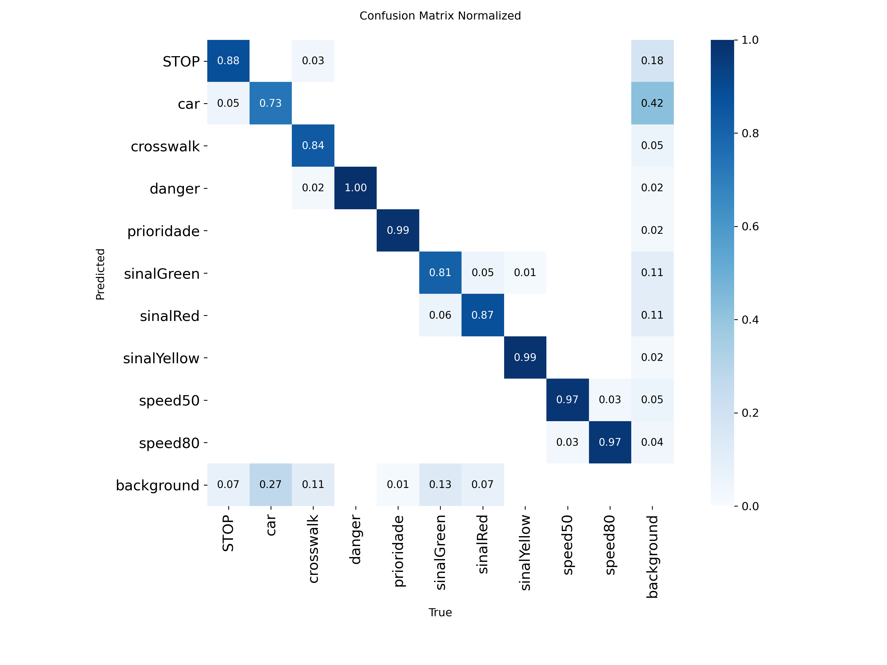

# YOLO Object and Lane Detection

This project implements a YOLO-based model for object and lane detection, optimized for deployment on resource-constrained devices like the NVIDIA Jetson. It includes scripts for training the YOLO11 model and augmenting the dataset using image transformations.

## Project Overview

The project consists of two main scripts:
- **train_yolo.py**: Trains a YOLO11 Nano model for object and lane detection with custom configurations optimized for Jetson.
- **augment_dataset.py**: Applies data augmentation techniques to expand the dataset, improving model robustness.

The project uses the Ultralytics YOLO library and Albumentations for data augmentation. The trained model and results are saved in the `./models` directory, and the augmented dataset is stored in `./dataset`.

## Requirements

To run this project, ensure you have the following dependencies installed:
- Python 3.8+
- Ultralytics (`pip install ultralytics`)
- Albumentations (`pip install albumentations`)
- OpenCV (`pip install opencv-python`)
- NumPy (`pip install numpy`)
- tqdm (`pip install tqdm`)
- PyTorch (compatible with your GPU or Jetson device)
- Graphviz and Doxygen (for generating documentation)

## Installation

1. Clone this repository:
   ```bash
   git clone <repository-url>
   cd <repository-directory>
   ```

2. Install the required Python packages:
   ```bash
   pip install -r requirements.txt
   ```

3. Ensure your dataset is structured correctly (see Dataset Structure below).

4. (Optional) Install Doxygen and Graphviz for generating documentation:
   ```bash
   sudo apt-get install doxygen graphviz
   ```

## Dataset Structure

The dataset should be organized in YOLO format:
```
dataset/
├── data.yaml
├── train/
│   ├── images/
│   └── labels/
├── valid/
│   ├── images/
│   └── labels/
```

The `data.yaml` file should specify the paths to the training and validation sets, along with class names.

## Usage

### 1. Data Augmentation
To augment the dataset, run:
```bash
python augment_dataset.py
```
This script generates augmented images and labels, saving them in `./dataset`. Configure the input and output directories in `augment_dataset.py` if needed.

### 2. Model Training
To train the YOLO11 model, run:
```bash
python train_yolo.py
```
The script trains the model for 200 epochs, saving checkpoints every 20 epochs in `./models/yolo_object_lane/weights`. Validation metrics (mAP@0.5 and mAP@0.5:0.95) are printed after training.

### 3. Documentation

[](https://nunotaboada.github.io/MLDrivableAreaDetection/)

Comprehensive documentation for the project is generated using Sphinx, covering all modules, including model.py, dataset.py, and train.py. The documentation is available as HTML and includes an index that links to all modules and reports.
Requirements
The following packages are required for testing and documentation:

- pytest
- pytest-cov
- pytest-html
- sphinx
- sphinx-rtd-theme

Install them using:

```sh
pip install pytest pytest-cov pytest-html sphinx sphinx-rtd-theme
```
Running Tests and Generating Coverage Reports in terminal:

```sh
# To run tests and generate coverage reports using pytest:
pytest tests/ --cov=dataset --cov=train --cov=model --cov-report=term --html=report.html -v --tb=long
```
Tests are located in the `tests/` directory.
The coverage report will be generated in terminal

The test report will be saved as `report.html`.

## Confusion Matrix

Below is the confusion matrix for the trained YOLO11 model, evaluated on the validation set. 




## Results

- **Model**: YOLO11 Nano
- **Training Epochs**: 200
- **Image Size**: 320x320
- **Batch Size**: 8 (training), 16 (validation)
- **Validation Metrics**: See `train_yolo.py` output for mAP@0.5 and mAP@0.5:0.95.

Check the `./models/yolo_object_lane` directory for training logs.


## Acknowledgments

- Ultralytics YOLO for the model framework.
- Albumentations for data augmentation.


Developed by: Team07 - SEA:ME Portugal

[]()